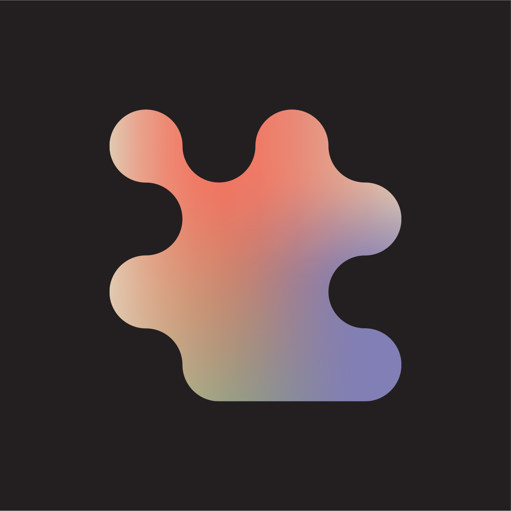
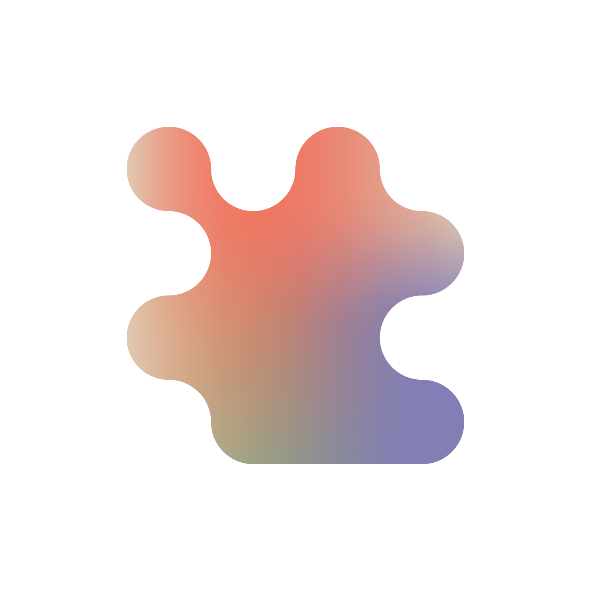
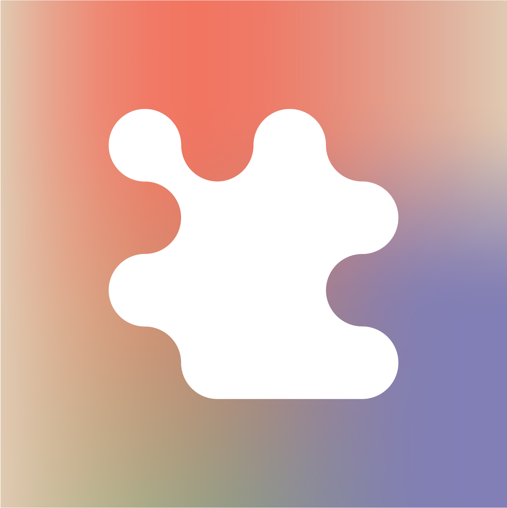
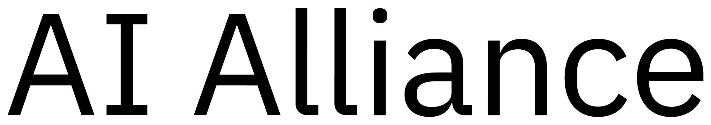

# AI Alliance resources:

## Logo 
   

* [Logo (on black background)](images/Symbol_main_on_black.jpg)
* [Logo (on transparent background)](images/Symbol_main_on_white.jpg)
* [Logo (white on Gradient)](images/Symbol_monochrome_on_gradient.jpg)
* [All Logos](images/02%20Symbol-20250409T164404Z-001.zip)

## Wordmark 
 

* [Wordmark Pos (black on transparent background)](images/ai_alliance_wordmark_pos.png)
* [Wordmark Rev (white on transparent background)](images/ai_alliance_wordmark_rev.png)
* [All Wordmarks](images/01%20Logotype-20250409T164407Z-001.zip)
  
## Technical Resources
### [Hugging Face Space](https://huggingface.co/aialliance)

## Guides
### [AI Alliance Getting Started Guide (draft - 2025)](https://docs.google.com/presentation/d/1a4gwcaCJPl9Bajgvz2ttf7yItIzX6GXrwToBmFc9wyM/)

## Online Books
### [Training LLM on large GPU Clusters](https://huggingface.co/spaces/nanotron/ultrascale-playbook)
